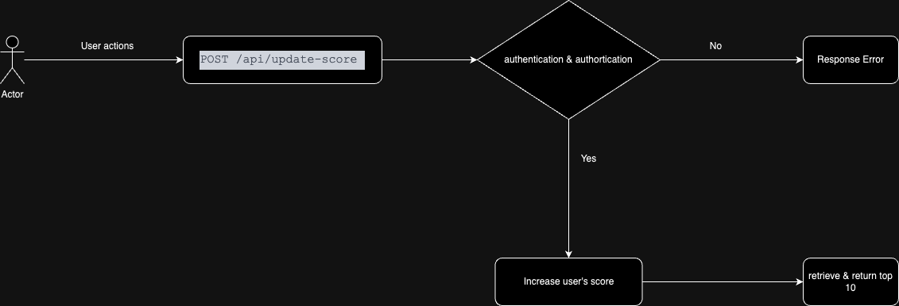

# Scoreboard API Service

## Requirements

1. **Real-time Updates**: The scoreboard must dynamically display the top 10 user scores.
2. **Score Increment**: When a user completes an action, the user's score should be updated via an API call.
3. **Authentication**: The server must authenticate each request to prevent unauthorized score updates.
4. **Top 10 Scores**: The API should provide access to the top 10 user scores.

## API Endpoints

### 1. `POST /api/update-score`
This endpoint receives a request to update a user's score.

#### Request Body
```json
{
  "user_id": "string",
  "score_increment": "number",
  "auth_token": "string"
}
```
#### Description request body

•	user_id: Unique identifier for the user whose score will be updated.

•	score_increment: The value to add to the user’s score.

•	auth_token: Token used to authenticate the request.

#### Response
```json
{
  "status": "success",
  "message": "Score updated successfully"
}
```

#### Error Response
```json
{
  "status": "error",
  "message": "Unauthorized request"
}
```

### 2. `GET /api/top-scores`
This endpoint retrieves the current top 10 user scores.


#### Response
```json
{
  "top_scores": [
    {
      "user_id": "string",
      "score": "number"
    },
    ...
  ]
}
```

## Database Model

The database should store the following data for each user:

    •	user_id (string): Unique identifier for the user.

    •	score (integer): Current score of the user.

Additionally, we should maintain an index or a sorted list to efficiently retrieve the top 10 highest scores.

## Flow of Execution

1.	A user completes an action, triggering a call to the POST /api/update-score endpoint.
2.	The server validates the auth_token to verify the user’s authorization.
3.	If the token is valid:

    •	The server increments the user’s score by the provided score_increment.

    •	The server retrieves and returns the updated list of top 10 scores.

4.	If the token is invalid, the server responds with an error.



## Security

•	Token Authentication: Each score update request requires a valid auth_token to authenticate the user, preventing unauthorized score manipulation.

•	Rate Limiting: Implement rate limiting for all endpoint to prevent abuse from malicious users.

•	Data Validation: 

    •	score_increment is a positive integer
    
    •	user_id is an existing user.

## Live Update

Real-time updates can be achieved using WebSocket, allowing the system to push updates to clients whenever the leaderboard changes. This ensures the scoreboard remains up-to-date.

## Performance Considerations

•	Optimize the API for fast retrieval of the top 10 scores with index in the database.

•	Ensure the database can handle frequent score updates without performance degradation.

•	Caching mechanisms (e.g., Redis) can improve performance for fetching the top scores.

## Error Handling

•	Invalid auth_token: Return a 403 Unauthorized response.

•	Invalid or Missing Parameters: Return a 400 Bad Request error if parameters are missing or invalid.

•	Internal Server Errors: Return a 500 Internal Server Error.

## Future Improvements

•	Add support for filtering top scores based on parameters such as region or game type.

•	Consider adding pagination support for the GET /api/top-scores endpoint to handle larger datasets.